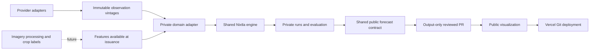

# Radar sister-project architecture

Agriculture Radar and Inflation Radar remain separate products, repositories and Vercel projects. Their public visualization repos consume published observations and forecast outputs. Their private forecast repos own modeling policy, fitted models, candidates, evaluation and feature engineering.

## Shared packages and release ownership

`radar-forecast` is a private Python package. Its initial source home is `inflation-forecast/packages/radar-forecast`; both forecast projects consume the identical versioned wheel. It provides Nixtla StatsForecast panel execution, finite monthly-panel eligibility, embargoed evaluation stages, point scoring, horizon-specific empirical bands and an availability gate for future drivers. Candidate registries, transforms, model selection policy and reconciliation remain domain adapters. The main inflation model and its shadow pilot both use the shared panel runner.

`radar-contracts` is public and has no forecasting-library dependencies. Its source home is `inflation-viz/packages/radar-contracts`. All four repos consume the same versioned wheel. It validates and allowlists public output at every nesting level, and carries the Radar brand CSS and mark. Public repos contain only this public package; the private engine is never copied into them.

Versioned wheels are committed under `vendor/`, with SHA-256 pins in both `uv.lock` and `vendor/radar-packages.json`. CI checks wheel integrity, source-to-release agreement in the owning repo and generated brand-asset agreement in each visualization. A fresh CI runner needs no cross-private-repository token to install the shared engine. This is a deliberate initial distribution choice; moving the source to a dedicated private `radar-forecast` repo or private package registry does not require changing domain APIs.

The coordinated release tool lives in the private engine's source repository. Build once, update all consumers together, run all four CI suites, and publish coordinated commits. Change the package version before changing an already-published artifact. Each product's data release remains independent.

## Common contracts

Training panels use Nixtla's long form: `unique_id` (stable series identity), `ds` (period start), `y` (observed target). Frequency, transform and units belong to the domain adapter. Monthly gaps, stale cutoffs and nonfinite values are excluded rather than silently filled. Saved observations carry their own provider/release provenance; freezing a revised-history vintage does not recreate a historical information set.

The public v2 forecast envelope uses `schemaVersion`, `generatedAt`, `dataVintage`, `forecastOrigin`, `horizonMonths`, `level`, `coverage`, `totalUniqueId` and `points`. Each point uses `unique_id`, `ds`, `yhat`, `lo`, `hi` and optional nested `bands`. Agriculture adds allowlisted `runId`, `status`, `evaluationBasis` and per-series units/interval status. Unknown fields, including methods, coefficients, scores and selection decisions, are stripped. Every included series must cover the same contiguous horizon. Existing agriculture v1 archives remain readable through its adapter; the frontend export is v2.

Inflation defines an additive contribution hierarchy and a coherent headline; agriculture prices have no additive total. Confidence bands are calibrated for their actual target, never formed by adding component quantiles. Log-price transforms preserve positivity. Different horizons and baselines are valid policies on the same engine. StatsForecast is the current shared execution path. MLForecast can add release-safe covariates, HierarchicalForecast can handle validated geographic/commodity hierarchies, and NeuralForecast can be introduced when data and evaluation justify it; installing a library alone is not a modeling implementation.

The current public contract is explicitly monthly. Annual/seasonal yield publication will require a versioned cadence/season extension, with consumer migration tests, before any yield overlay is released.

## Brand and hosting

Both sites use the same Radar mark, system typography, charcoal surfaces, blue/teal brand accents, floating navigation and card foundations, with consistent system light/dark themes. Domain charts keep their own semantic palettes and layouts. Brand assets come from the public contracts package and are checked against its pinned release.

Both Vercel projects use native Next.js deployment from public visualization repos, `web` as their root, `main` for production and branches/PRs for previews. Observations refresh independently of modeling. Private forecast publication remains a manual output-only PR; merging the PR triggers the visualization deployment. No forecast code or credentials are required in the Vercel application.

## Satellite extension

See [SATELLITE_ROADMAP.md](SATELLITE_ROADMAP.md). Satellite processing will be an upstream feature/label capability, not a browser or Vercel build task. The current app publishes benchmark-price forecasts only.
